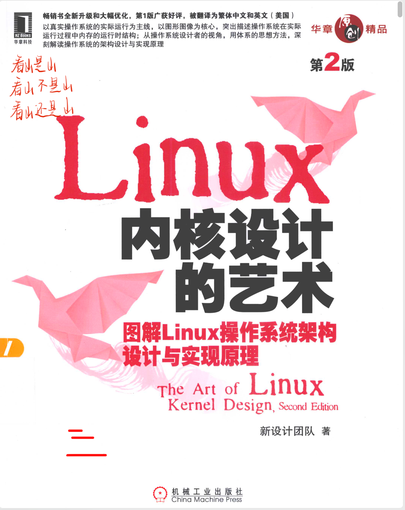

# 操作系统高级教程-杨力详

## 主要内容

基于 intel x86 IA32 指令集，会讲 Linux 源码，从基础需求推导OS的设计。

**后记：**大有裨益，强烈推荐每位CS同学来听。忠告是尽量课前看老师的书籍作为预习，前期跟着老师的代码思路。熟悉代码框架后，基本自己看教材就能学会了（老师不点名，dddd）。课堂上讲解的内容，大多都是教材的内容；但有时老师会引申部分专题，这个专题的探讨还挺有意思的，也可以多看群里讨论的专题。

## 课程资料

linux0.11源码：[Maxpicca-Li/APOS23-linux0.11-src: Advanced Principles of Operating System (github.com)](https://github.com/Maxpicca-Li/APOS23-linux0.11-src)

 [Linux内核完全注释-赵炯.pdf](Linux内核完全注释-赵炯.pdf) 

 [IA-32 架构软件开发人员手册-卷3-中文版.pdf](IA-32 架构软件开发人员手册-卷3-中文版.pdf) 

课本：

## 成绩组成

不点名。

100%闭卷考试（后来老师说80%闭卷+20%白送平时分）

## 考试

均为思考题原题。

[操作系统高级教程-课本复习 (yuque.com)](https://www.yuque.com/maxpicca/ucas-courses/anozg2wyiz7o5rgg)

[操作系统高级教程-思考题整理 (yuque.com)](https://www.yuque.com/maxpicca/ucas-courses/gq2wqockcb7mi0k8)

## 学有所得

1. Linux启动过程犹如盘古（BIOS）开天地。
2. Unix一切皆文件。
3. Linux操作系统的管理，实际上就是一个个账本。