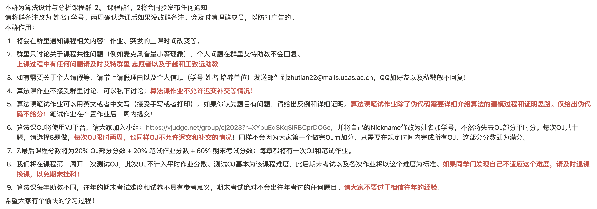

# 算法分析与设计-卜东波

# 主要内容

1. 算法分析与设计流程
2. 分治
3. 动态规划
4. 贪心
5. 线性规划
6. 网络流

**后记：**老师不仅仅是讲解普通的算法，还会做各个算法之间的联系，如Dijkstra与贪心，最大流和最小割与对偶问题，拟阵等等。课程内容源于算法，高于算法。忠告选择该课的同学尽量有一定算法基础，且每节课尽量预习（老师的讲义、PPT、B站上也有相关录屏等），否则很难跟上老师的思维，加之又在晚上开课且一上就是三小时，听不懂就贼容易打瞌睡。

## 成绩组成

- 不点名
- 20%OJ分数+20%笔试作业+60%期末考试
- 期末形式：**闭卷，全英文，6～7道算法题**
  - P1\~P4：作业题随机抽题的变换题，范围为分治、动态规划、贪心、线性规划、网络流，根据当年授课进度而定。
  - B1~B2：Bonus题目，综合知识点考试

## 复习

[算法设计与分析备考 (yuque.com)](https://www.yuque.com/maxpicca/ucas-courses/ghq5l4w17rs411na)

[期末专题 | 国科大算法设计与分析 卜东波 期末考试攻略 (qq.com)](https://mp.weixin.qq.com/s?__biz=Mzg3NzY2MzAyMg==&mid=2247484519&idx=1&sn=9fa7d95ae71e3ab1496da3b45993e899&chksm=cf1ec226f8694b30b5a2d9440ac787061a79c4f7226cad078a7fbbc8961d5080915ce1b7b29e&token=1198436707&lang=zh_CN#rd)

## TAKE-HOME MESSAGE

#TODO

