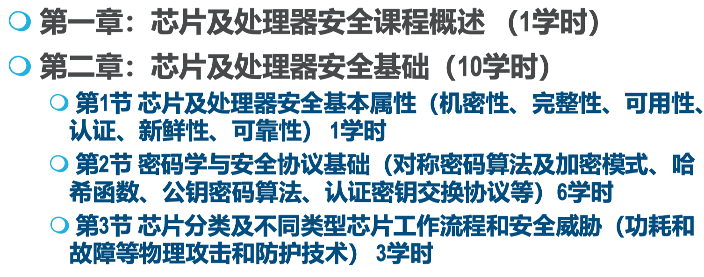
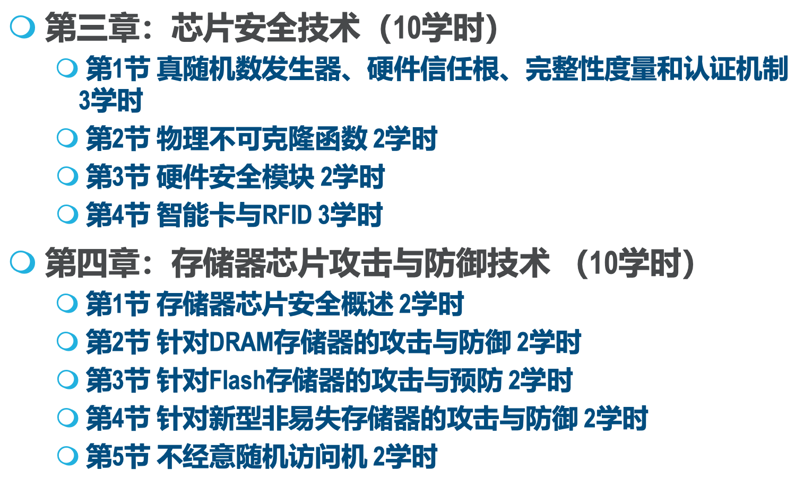
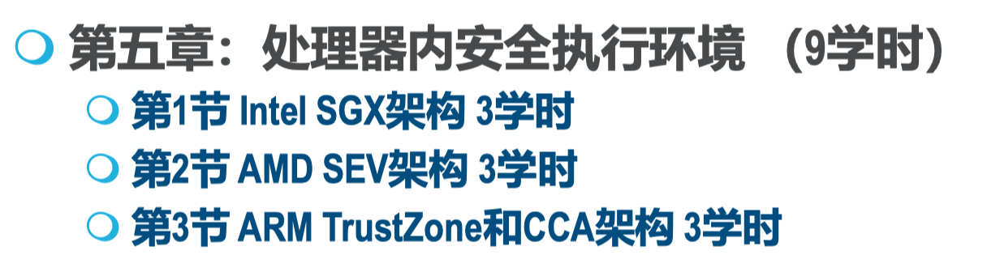

# 芯片及处理器安全-王文浩

# 主要内容

**后记：**想要认真学的同学，建议课上用思维导图梳理。因为老师讲的内容对于非安全同学来说真的很杂，没有摸清楚脉络，听着听着就迷糊了。

## 参考资料

[2023-2024-芯片及处理器安全-论文列表 (qq.com)](https://docs.qq.com/sheet/DYmF0RXFkdHhHdE9C)

## 成绩组成

不点名。

课程报告100%（参与报告讲解的同学为：课程报告80%+报告讲解20%）。

