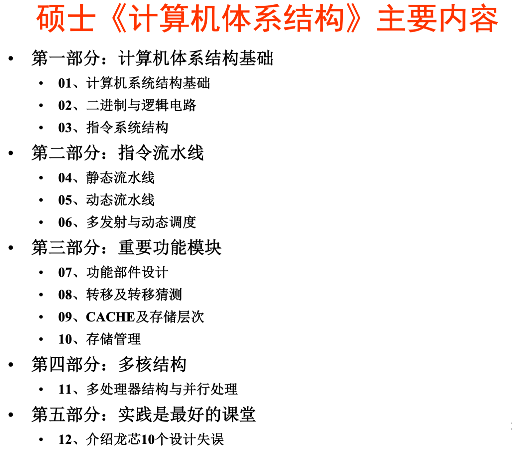
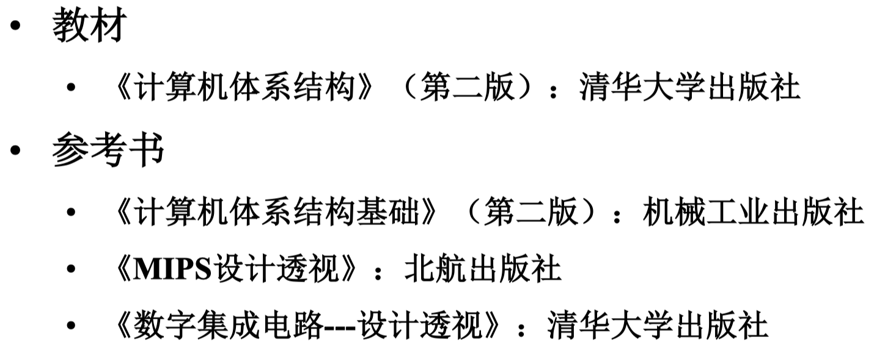
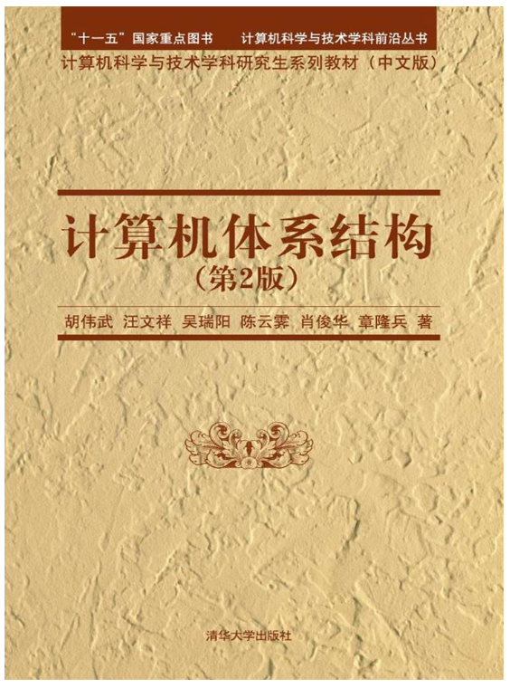
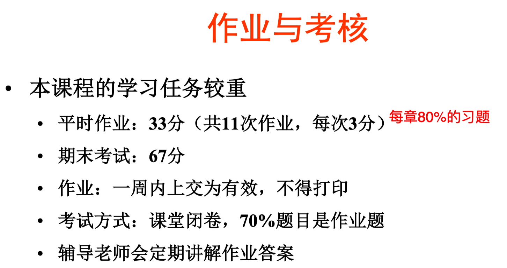

# 计算机体系结构-胡伟武

## 主要内容

**后记：**胡伟武老师和汪文祥老师讲的内容非常系统全面，但每个部分相对比较基础，如果想要深入了解某个模块，还得自学。作业都是手写，但网上一般有答案。

## 教材与参考书籍

[计算机体系结构基础 (foxsen.github.io)](https://foxsen.github.io/archbase/index.html)

## 成绩组成

不点名。

## 考试

70%作业题。

[计算机体系结构备考 (yuque.com)](https://www.yuque.com/maxpicca/ucas-courses/ayncui7c8b6bned7)

## 学有所得

1. 对于体系结构学生来说，指令手册很重要，要认真研读。感觉学 ISA，像是学习一门新的编程语言。
2. 体系结构学生可以多积累做IP、Java虚拟机的工程经验。
3. 要有自己的创新，中国的学术界尽量跟着中国的产业界，而不是美国的产业界和学术界。
4. 积极参加国际学术会议的同时，别忘了去看看**国际工程会议**，后者实用性更强。

