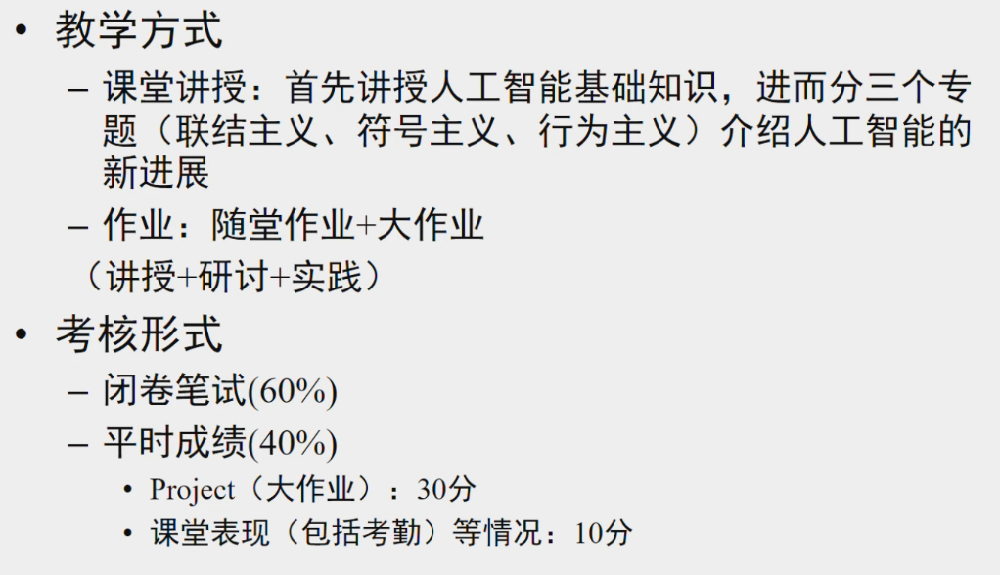
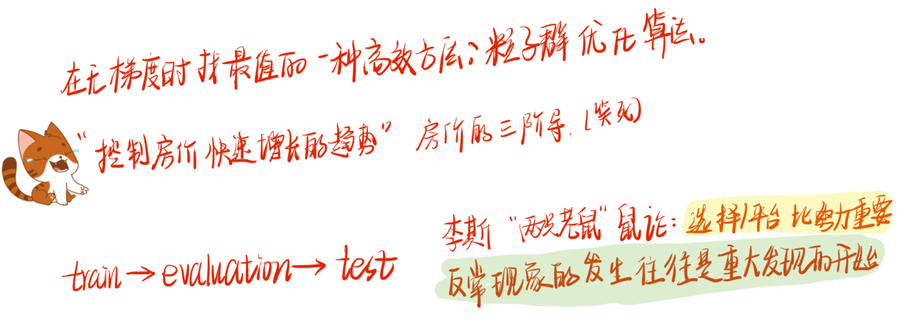

# 高级人工智能-沈华伟

## 主要内容

- 符号主义
  - 逻辑
  - 搜索

- 联结主义
  - Learning

- 行为主义
  - 强化学习
  - 群体智能
  - 策略学习
  - 博弈论
  - 因果论

**后记：**学这么课经历了三个思考历程：（1）虽然是体系结构学生，但是人工智能这么火，了解一下避免落伍吧；（2）讲得基本都是基础的内容，有些太绕了听不懂，有些太简单了不想听；（3）复习的时候才发现原来学了这么多知识，每一个都很零散，但又都感觉很实用。大赞沈华伟老师（INTP），老师很有趣、亲和，自嘲”好为人师、不知死活、新时代老师“，老师太可爱了！！！

忠告是如果你发现你听不懂了，别担心，大概率不是自己的问题（假装是这样的），去找找别的视频看吧。罗平老师上的内容，也可以直接看cousera的课程。

## 教材与参考书籍

教材：

- [Artificial Intelligence: A Modern Approach, 4th US ed.](http://aima.cs.berkeley.edu/)

视频：

- [Coursera | Online Courses & Credentials From Top Educators. Join for Free | Coursera](https://www.coursera.org/learn/rengong-zhineng/home/week/1)
- [【中英双语字幕】伯克利CS188《人工智能导论》by Nikita Kitaev-2022](https://www.bilibili.com/video/BV1r3411p7H8/)
- [图卷积神经网络-沈华伟-2020](https://www.bilibili.com/video/BV1ta4y1t7EK)

笔记：

- 罗平：[AI-Fundamental](http://www.ai-fundamental.com/)

## 成绩组成

不点名。

实际上没有留随堂作业。大作业如下：

## 考试

和往年题有70%的相似度。

[高级人工智能-备考 (yuque.com)](https://www.yuque.com/maxpicca/ucas-courses/ps68kv4vscurz1gd)

## 学有所得

得的基本上是沈华伟老师的段子，哈哈。

1. 杂七杂八：
   
2. **大模型思考：**我国学者往往在追随美国的学者，我们看到了大模型的好用，于是基于大模型做一些任务延伸，但我们不知道其中的原理。就像10年前，我们基于美国的芯片，在面包板上做布线，我们培养了一堆布线工程师，于是现在我们的芯片被卡脖子了，缺“芯”了。而10年后的今天，我们基于美国的大模型做任务延伸，培养了一堆大模型训练工程师，10年后我们会不会在这块上再次被卡脖子，少“魂”了？
   外国的学者，之于大模型，也是一步一步做出来的。他们预见了当参数过了10亿会有智能的涌现，于是大模型诞生了。我国学者，在追逐外国学术脚步的同时，不妨停下来想一想“为什么”，“怎么来的”，去思考其中的原理，而不只是享受并使用别人的知识产物。
3. 对于科研人而言，**“不重复造轮子”**是不是最大的谎言？
4. 学习一上来可以接触宏观的概念，而不要陷入小细节中，否则你会发现科研一点也不美妙。
5. 看论文、学知识需要有框架思维，从顶层了解“它要干嘛”。
6. 讲学术报告和讲课一样，得先让人想听。画几张直观的图，给人讲懂也是一种本事，给别人提供一个 eye guideline。
7. 每个学科发展过程中，都有几个里程碑的事情。了解清楚里程碑，是科研的必要环节。
