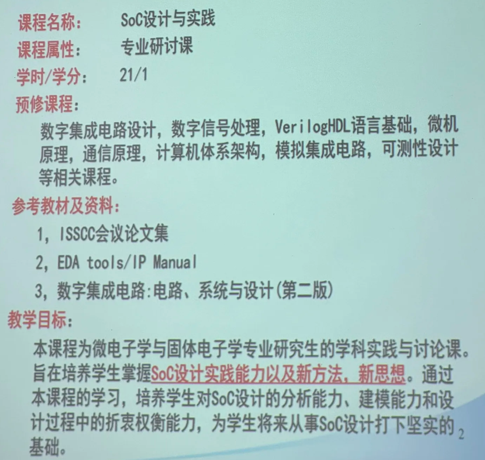
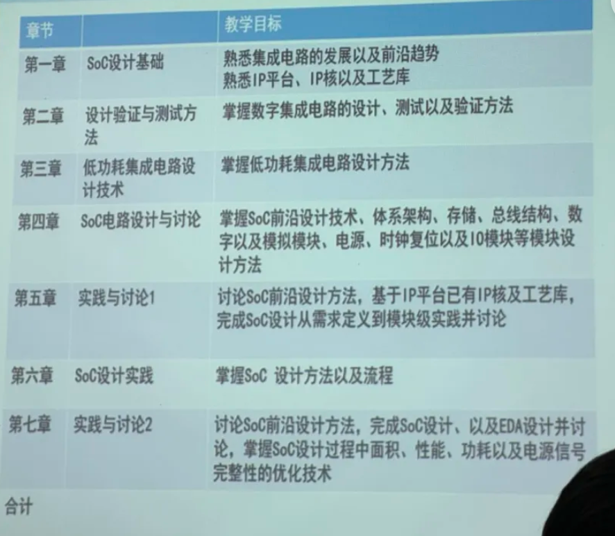
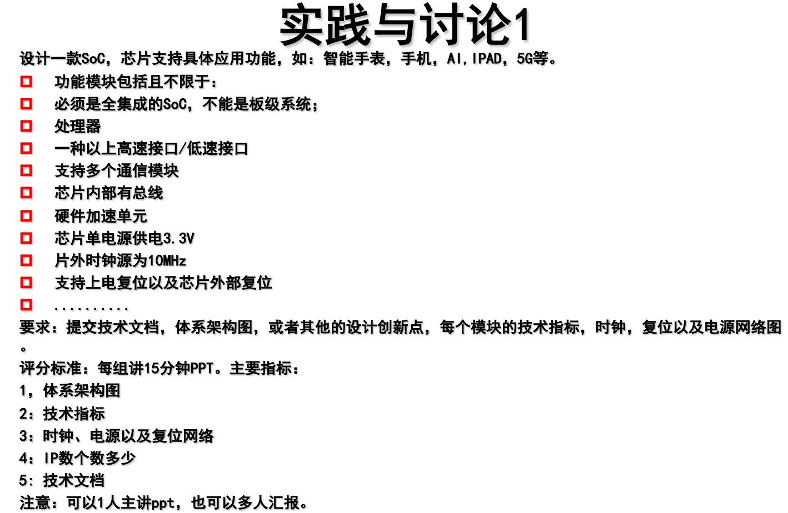

# SOC 设计与实践

## 主要内容

课程概要和主要内容如下：

实践与讨论要求如下：

## 成绩组成

* 90分：实践及讨论
* 10分：考勤（但老师不点名）

## 学后感

乔老师讲得非常好，而且非常有经验。课堂讲解、举例等让我一个非微电子所的学生也能串起他讲的内容。实践与讨论上，老师也会为展示的同学进行详细的分析（特别是工业界需求分析和实践优化上，这也导致展示时间非常长，最后只展示了2组左右）。虽然一些细节的实现仍然没有学会，但能够在整体上把握SoC的设计流程了。
