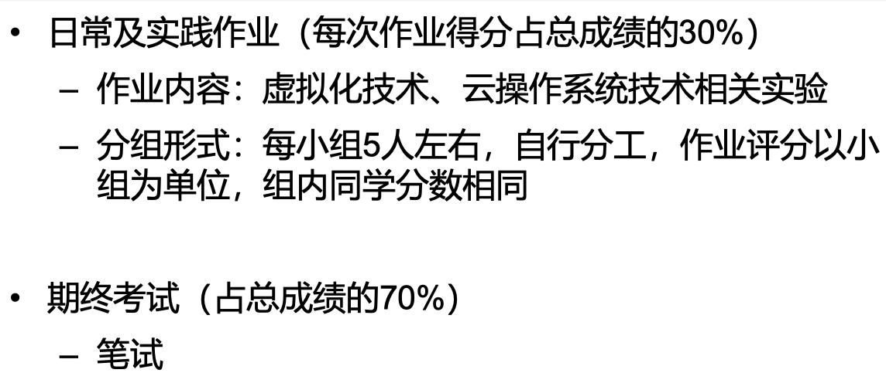

# 云计算技术

## 主要内容

三个老师讲授，讲述虚拟化技术（CPU虚拟化、内存虚拟化、IO虚拟化、高级功能等）、容器技术（linux namespace, cgroup, docker等）、云操作系统（OpenStack等）、云存储技术（Ceph分布式存储系统等）、云计算的发展和趋势（Unikernel、嵌入式虚拟化等）的内容。

## 课程资料

1. 期末复习
   * [云计算课程回顾.pdf](云计算课程回顾.pdf) 
   * [《云计算期末样题-24春》](https://www.yuque.com/maxpicca/ucas-courses/wcx7kexgbtmwg2vr)
2. 期末大作业
   * [Maxpicca-Li/CCT24-container-engine](https://github.com/Maxpicca-Li/CCT24-container-engine)

## 成绩组成

PPT里陈述的成绩占比如下图所以：

实际情况是：

1. 没有签到占比，但因为选课人数少+同学们不想听，于是课堂人很少，老师觉得人太少，想用签到吓吓我们，但实际上一次也没有签到。但有一次课堂作业（算是伪签到了）。
2. 一个云存储作业（概念调研题）、一个实验大作业（开发一个容器引擎）。
3. 期末考试**闭卷**。

## 学后感

这门课课讲的不咋的，还是早八。但因为闭卷考试，最后一周突击学习的时候，才发现很多课上没有听进去的知识（比如CPU虚拟化、内存虚拟化、IO虚拟化等的原理）其实还挺有用且有趣的，但这部分知识知识少数，绝大多数都是无聊的还要考的概念细节。因为闭卷，且考试内容概念题占大多数，复习的过程中有种回到大学思政课闭卷考试的背诵的感觉，这种感觉总是让我怀疑这真的是研究生课程的考核吗？？？

只选了理论课的怨种建议，**如果有选这门课程的必要，最好把实验课也选上**，纯理论课最后写大作业会比较难受，且纯理论有种知识进了脑子又离开的错觉。
