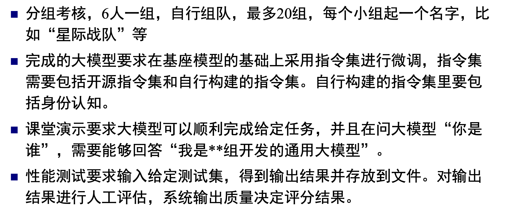

# 通用大模型原理及训练实践

## 主要内容

理论上：老师会介绍大模型的发展历程和原理，并介绍 chatGPT 相关的原理、关键技术等。

实践上：基于计算所老师开发的大模型完成两个指令微调（自我认知指令+特定任务指令）任务，在最后一堂课现场演示微调后的模型问答，并提交重新训练的模型+数据+评估结果。具体要求如下：

## 成绩组成

* 70分 系统演示
* 20分 效果评测
* 10分 签到

## 学后

了解了大模型的发展和原理（虽然没有特别听懂后面的计算）。课程提供实验平台，任务按照实验书一步步来，基本都能完成。

