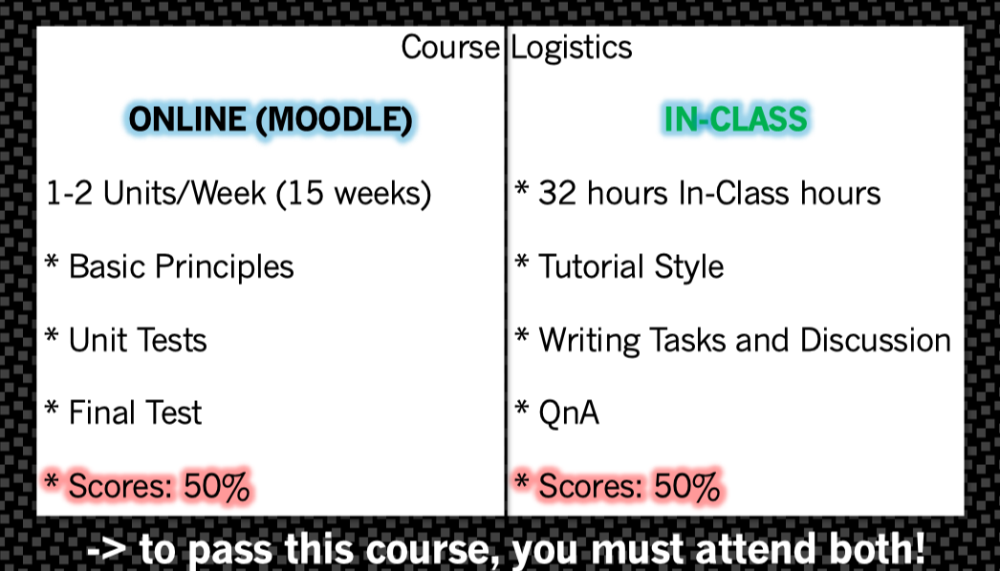
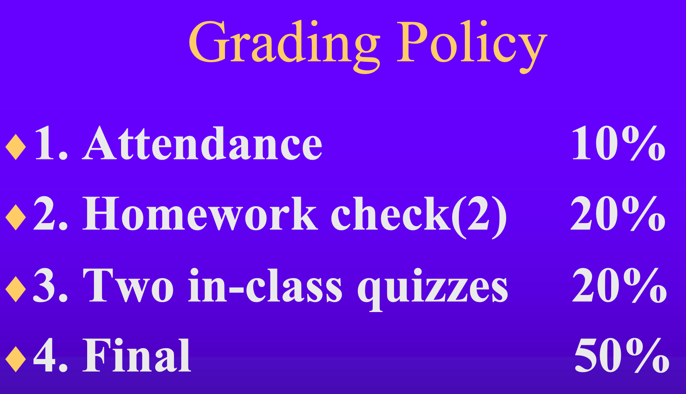
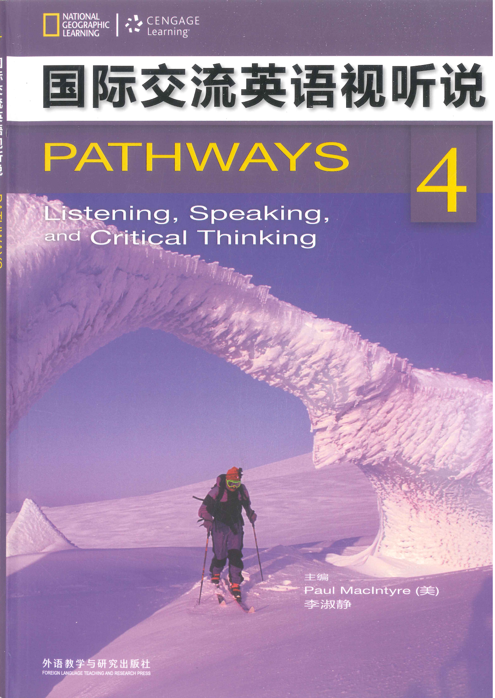

# 课程列表

## 基础学术论文写作

 [高级语音训练24春-course-introduction.pdf](高级语音训练24春-course-introduction.pdf) 

**主要内容**：

讲解学术写作（包括中国学生常见写作问题）等内容。课上英文授课，慕课中英文都有。

**成绩组成**：

1. 线上慕课学习 50%
2. 课堂学习 50%（课堂任务充当考勤，每节课结束时通过二维码上传笔记；没有课后作业）

**学后感**：

course intro 里面感觉有些夸大难度了，慕课内容压力不是很大，学到的内容也比较实用；课堂氛围比较轻松，TJ老师是德国人，互动会比较多，可以练习口语和听力。

## 高级语音训练

 [高级语音训练24春-course-introduction.pdf](高级语音训练24春-course-introduction.pdf) 

**主要内容**：

发音训练、节奏训练（讲故事、绕口令、口头禅、英文歌等）。

**成绩组成**：

**学后感**：

中国老师，英文授课，可以请假。每节课后会有一个Fast Speak English（FSE）的听力作业，可以养成一个听写FSE的习惯。期末作业不限形式，3分钟配音、唱歌、讲故事、演讲模仿、脱口秀等都可以，要求脱稿。学习增益不多，因为自己发音很不准，所以上了这个课。

## 积极心理学

**主要内容**：

积极心理学相关，包括但不限于心流、人际关系、成就感等主题。

**成绩组成**：

1. 5 分：考勤，可请假可代签
2. 15 分：一次课堂发言/期末小题
3. 80 分：5～6 题抽选，约 2000 字，严禁抄袭

**学后感**：

轻松愉快。

## 国际交流英语听说

**主要内容**：

基于教材《国际交流英语听说》的每个单元的主题进行授课。包括 urban chanllenge, protecting our planet, beauty and apperance, tradition and progress, money in our lives, health and fitness, mind and memory, food and concerns 等主题。

**成绩组成**：

1. 10% 出勤
2. 20% 课堂表现
3. 30% 中期展示（两人可带稿的3分钟主题对话）
4. 40% 期末展示（一人尽量脱稿的3分钟主题报告）

**学后感**：

中国老师，英文授课。课堂氛围轻松愉快，会有很多小组讨论，组内也是英文交流，非常锻炼口语能力。学完课程最大的收获是不再哑巴英语了。
