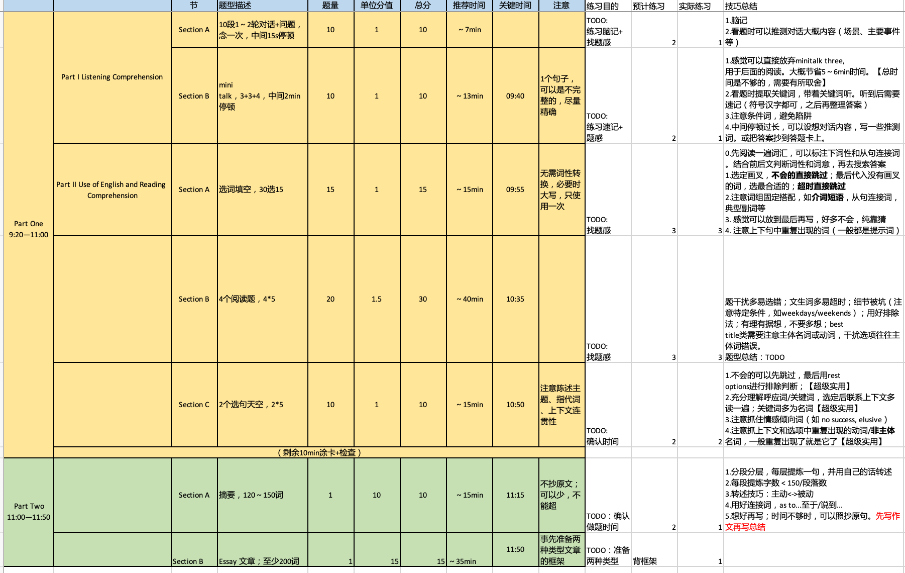
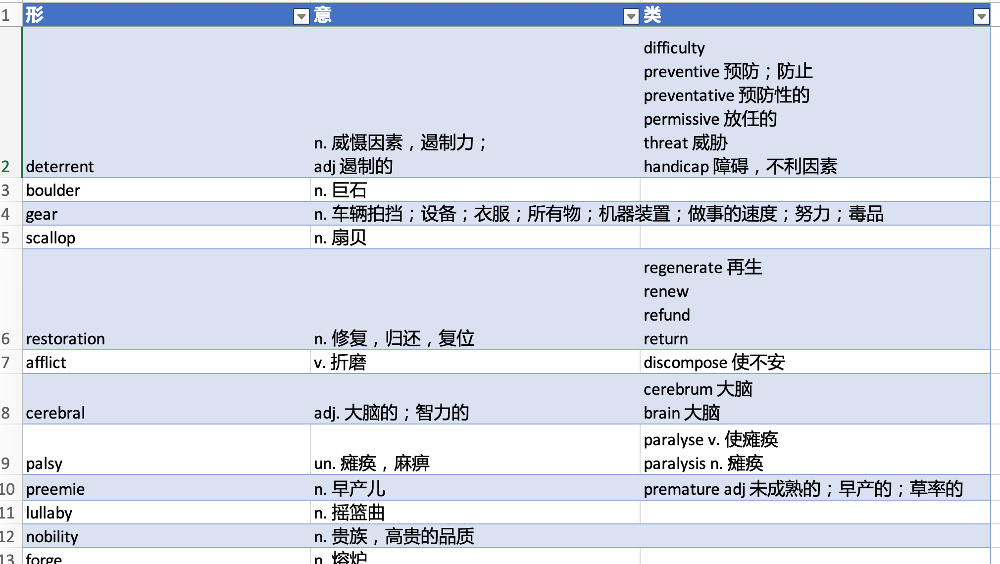

英语AB学习资料：https://pan.baidu.com/s/1_TvNLgQw4TMtLprYNeMPNg?pwd=uua4

# 英语A

英语 A 我是慕课类型，按照课程规划来即可。

# 英语B

英语 B 秋季学期免修没有通过，选择了春季学期的课程，分别是 Carl James Hutchinson 的高级口语和杜静的高级写作。

* 20分 高级口语 Carl James Hutchinson
  * 老师没有提及分数占比，课中讲到的内容都是非常日常的主题（如greetings, describe people's clothes, emotions and feelings, man and woman, senses），课中会有很多小游戏（如不说yes/no挑战、编故事接龙、现场魔术、问答循环、现场找人搭戏等），有几次的课后小作业需在下次课展示（如介绍指定名人、推销指定产品、和队友演情景剧等），期末是做一个3分钟专业介绍的presentation。
  * 学后感：我是捡漏捡到 Carl 老师的课程（非常幸运），高级口语非常推荐选择外教老师的课程，不用太担心听不懂。课程整体轻松愉快，老师很会整活，学习内容虽日常但很多表述是我12年英语学习没有接触过的，非常接近英美的生活。
* 30分 高级写作
  * 5分考勤（缺一次减0.5）+5分课堂表现+20分三次写作任务（4+7+9）
  * 学后感：老师人很好，会在第一节课给我们social时间选择组员，会给我们很多加分小项目（救小命），也会留2节课给我们做期末讲解（救大命），以保证我们的成绩；大部分时间是中文授课，讲的内容也比较实用（特别是图文描述的章节）；但是形式感很重，如分组固定座位、课中会有小组讨论并提交讨论结果等，虽不会刻意点名考勤，但固定座位少了你一眼就看出来了。
* 50分 期末考试
  * 和免修考试一致


## 期末考试

**时间推荐：**

```txt
09:20～09:35 20min 听力
09:35～10:20 40min 4篇阅读理解
10:20～10:35 15min 2篇选句
10:35～10:50 15min 短文填空
10:50～11:00 10min 抄答题卡并简单检查一下
11:00～11:35 35min 写作文（构思+小句15min，写20min）
11:35～11:50 15min 写摘要
```

**备考视频：**[国科大博士英语B期末考试要点讲解-1_哔哩哔哩_bilibili](https://www.bilibili.com/video/BV1o7411W7Dc/)

**备考推荐：**[试卷结构表+做题技巧+词汇积累](./试卷结构表+做题技巧+词汇积累.xlsx)

**备考资料：**https://pan.baidu.com/s/1_TvNLgQw4TMtLprYNeMPNg?pwd=uua4

表1：结构表+备考。用于备考参考。



表2：词汇。记录了形、意、类。“类”指联想到的词，包括近义词、反义词、词类转换、词组等。用于记录做题时遇到的“觉得重要”的词汇（方法源自B站某个忘记名字的师兄的介绍）。

